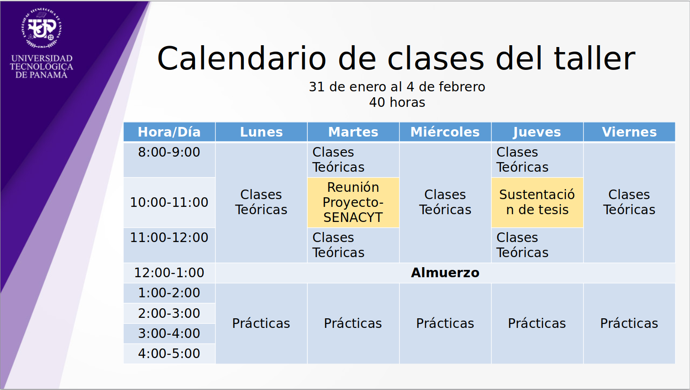

# Taller estadísticas aplicada al análisis de datos de un proyecto de investigación

<p align="center">

  

</p


Dictado por Dra: [Nathalia Tejedor](http://www.investigadores.utp.ac.pa/investigadores/nathalia.tejedor)

## Tabla de Contenidos
- [Taller estadísticas aplicada al análisis de datos de un proyecto de investigación](#taller-estadísticas-aplicada-al-análisis-de-datos-de-un-proyecto-de-investigación)
  - [Tabla de Contenidos](#tabla-de-contenidos)
  - [Description](#description)
  - [Instalation](#instalation)
    - [Usando git](#usando-git)
    - [Descargando como zip](#descargando-como-zip)
      - [Video tutorial](#video-tutorial)
  - [Organization](#organization)
    - [Material Didáctico](#material-didáctico)
    - [Talleres](#talleres)
    - [Talleres Resueltos](#talleres-resueltos)
    - [Assets](#assets)
  - [Enlaces a Videos de las clases grabadas](#enlaces-a-videos-de-las-clases-grabadas)
    - [Clase 1](#clase-1)
      - [Temas Desarrollados](#temas-desarrollados)
      - [Enlace al video](#enlace-al-video)
    - [Clase 2](#clase-2)
      - [Temas Desarrollados](#temas-desarrollados-1)
      - [Enlace al video](#enlace-al-video-1)
    - [Clase 3](#clase-3)
      - [Temas Desarrollados](#temas-desarrollados-2)
      - [Enlace al video](#enlace-al-video-2)
    - [Clase 4](#clase-4)
      - [Temas Desarrollados](#temas-desarrollados-3)
      - [Enlace al video](#enlace-al-video-3)
    - [Clase 5](#clase-5)
      - [Temas Desarrollados](#temas-desarrollados-4)
      - [Enlace al video](#enlace-al-video-4)
  - [Contacto](#contacto)

## Description

Suele ser difícil estar al tanto de las diferentes clases y talleres con diferentes mensajes y problemas con el equipo de teams

Quería encontrar una forma ordenada para mis apuntes y desplegar la información del curso de una forma más centralizada.

Así que cree un repositorio con la información del curso que actualizo 3 veces por día por cada clase e incluye lo necesario para continuar de manera satisfactoria el curso.

**¿Qué encontrarás en el repositorio?**

- Organización por cada clase dividida en material didáctico, talleres sin realizar y talleres realizados.
- Talleres completos en su respectiva clase por carpeta
- Enlaces a los videos grabados de la clase
- Descripción sencilla y temas dados ordenados por cada clase en un solo repositorio

**Ventajas del repositorio**

- ✅ Información centralizada y accesible de todo el curso, incluyendo diapositivas, videos y talleres
- ✅ Actualización del repositorio 3 veces o más por día
- ✅ Talleres resueltos y bien documentados que sirven de guía comparativa para sus propios resultados
- ✅ Instrucciones y documentación completa por clase.
- ✅ Uso avanzado empleando git con control de versiones y traceability de cada material en el tiempo.

## Instalation

### Usando git
Para esto debes de tener git instalado. 
```bash
git clone https://github.com/FernandoCutire/curso-estadistica-inv-utp
```

### Descargando como zip

1. Entra a la página 
2. Da click en code
3. Da click en descargar como zip

#### Video tutorial

<p align="center">

  

</p>

## Organization

Existe una carpeta clase por cada día dictado por el taller.
Lo que quiere decir que hay 5 clases

Dentro de cada clase existen 3 carpetas.
- Material Didáctico
- Talleres
- Talleres Resueltos
- assets

### Material Didáctico
Dentro de la carpeta **Material Didáctico** se encuentra los archivos teóricos expuestos en clase, como diapositivas y documentos con información

### Talleres
Dentro de los carpeta **Talleres** se encuentra los documentos de los talleres. Estos documentos poseen los documentos por desarrollar, con la pecularidad de estar vacíos.
Tienen el fin de servir para el estudiante como copia vacía por resolver.

### Talleres Resueltos
Dentro de la carpeta **Talleres Resueltos** se encuentran los documentos de los talleres ya desarrollados por el estudiante [Fernando Cutire](https://fernandocutire.com/).

### Assets
Dentro de la carpeta **assets* está material adicional para documentación de este repositorio. No es necesario ni útil para el curso, solo está incluida por motivos de documentación.

## Enlaces a Videos de las clases grabadas
En esta sección se muestran los videos pregrabados de las clases. 
**Es importante resaltar que debe de haber sido miembro del curso para acceder, ==de lo contario estará bloqueado.==**

### Clase 1
> En esta clase introductoria realizamos temas de introducción a la investigación científica. Tocando temas como las diferencias entre investigación cuantitativa, cualitativa.

#### Temas Desarrollados
1. Presentación de la clase (Introducción)
2. Investigación científica
3. Hipótesis
4. Contraste de Hipótesis

#### Enlace al video
[Clase 1: Introducción al curso + Investigación Cualitativa y Cuantitativa: A-Z](https://drive.google.com/file/d/1hKGpJdeQDsCillwq2FSKL7K-M9WL4hGY/view?usp=sharing)

### Clase 2

> Esta clase revisamos conceptos sobre población y muestra. También las técnicas de muestreo
 
#### Temas Desarrollados
1. Población
2. Muestra
3. Muestreo estratificado 
4. Muestreo por conglomerados

#### Enlace al video
[Clase 2: Definiendo conceptos de población y muestra + estrategias de muestreo](https://drive.google.com/file/d/1g5Mm5xFwpXaGNq2GfvFDN681HhZKxbDU/view?usp=sharing)

### Clase 3
> Esta clase no está disponible, probablemente no se ha subido todavía. Por favor revisar este repositorio más tarde.

#### Temas Desarrollados

#### Enlace al video
[Clase 3](https://fernandocutire.com/)

### Clase 4
> Esta clase no está disponible, probablemente no se ha subido todavía. Por favor revisar este repositorio más tarde.

#### Temas Desarrollados

#### Enlace al video
[Clase 4](https://fernandocutire.com/)

### Clase 5
> Esta clase no está disponible, probablemente no se ha subido todavía. Por favor revisar este repositorio más tarde.

#### Temas Desarrollados

#### Enlace al video
[Clase 5](https://fernandocutire.com/)


## Contacto 
- Fernando Cutire
- Correo para consultas: fernandocutire@gmail.com
- Página web: fernandocutire.com
  

[](https://www.upwork.com/)


[](https://www.upwork.com/)
